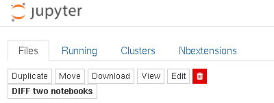

# nbdime_tree_diff
Extension for classic jupyter allowing nbdiff-web between two notebooks in the file tree

You need to have nbdime installed for this extension to work.

**NOTE:** sorry, this won't work with JupyterHub

Install like this:

```bash
pip install 'git+https://github.com/mister-average/nbdime_tree_diff.git'
jupyter nbextension install --py nbdime_tree_diff --sys-prefix
jupyter nbextension enable --py nbdime_tree_diff --sys-prefix
```
Refresh or restart your classic Jupyter tree interface, and there should be a new button named "**DIFF two notebooks**" which you can click after selecting exactly two notebooks in the same directory in your tree view:


